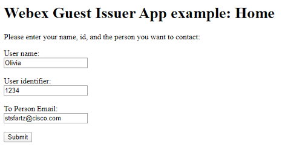
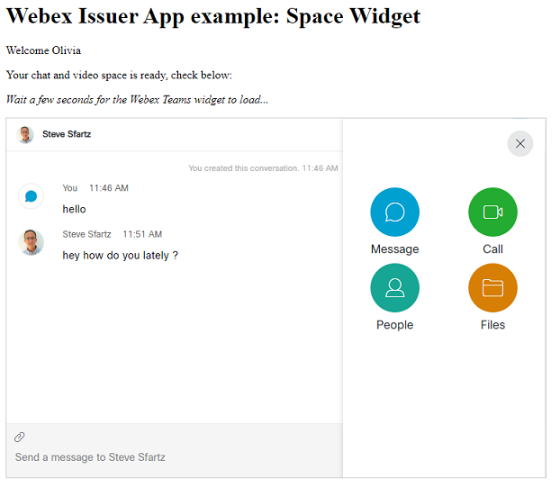

# Example of Webex Guest Issuer App in Node.js

This example illustrates how to create a server-side Webex Guest Issuer application that create an instant Teams Widget 
See [screenshots](#screenshots) below for more details about the app.

Pre-requisites:
- **you must be part of a Webex paying organization** to use the Webex Guest feature
- [create a new Guest application](https://developer.webex.com/my-apps/new/guest-issuer)
- place your Guest Issuer id and secret in the [.env](./env#L15) file or on the command line (see quickstart on glitch and on the command line below)


## Quick start on Glitch

Click [](https://glitch.com/edit/#!/import/github/ObjectIsAdvantag/guestissuer-widget-sample)

Open the `.env` file and paste the ['Guest Issuer'](https://developer.webex.com/docs/guest-issuer) **identifier and secret** for your application.

Your app is all set.

Click `Show` to run the demo


## Run the sample locally

``` bash
git clone https://github.com/ObjectIsAdvantag/guestissuer-widget-sample
cd guestissuer-widget-sample
npm install
DEBUG=lab* GUEST_ISSUER="XXXXX" GUEST_SECRET="YYYYY" node server.js
```


## Roadmap

- Add a server-side managed session: https://github.com/expressjs/session


## Screenshots

First enter the info for the guest user, and the email of the Webex Teams user you want to contact:


<br/>
<br/>

Then, simply chat, call, share files:


